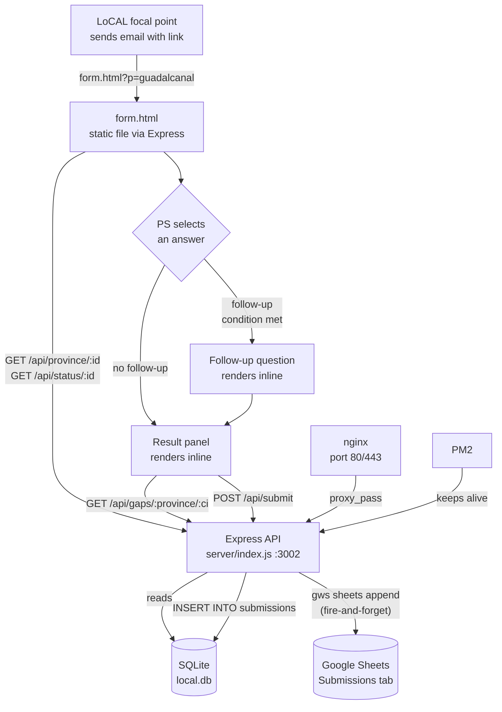
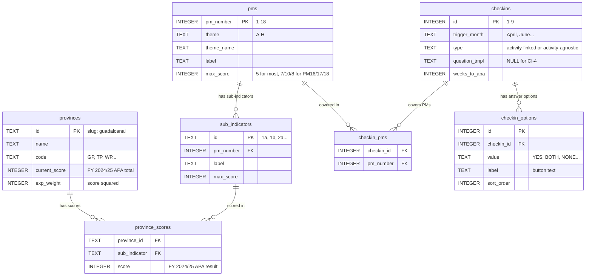
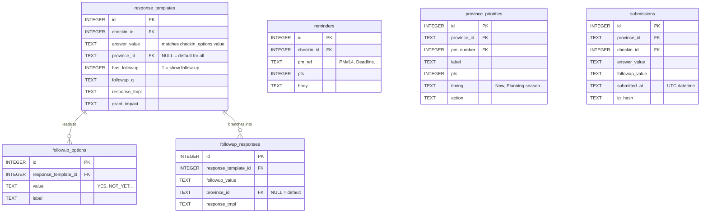
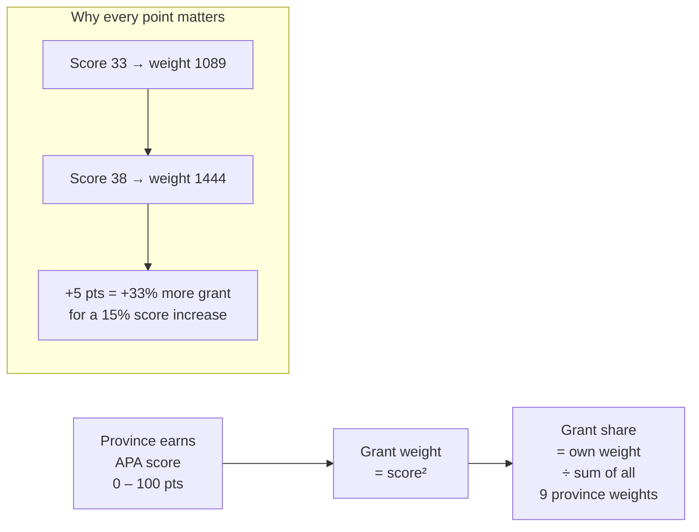

# Architecture — LoCAL Check-in Agent

> **Quick links:** [API](./API.md) · [Data Model](./DATA_MODEL.md) · [Runbook](./RUNBOOK.md) · [APA Logic](./APA_COMPLIANCE_LOGIC.md)

## What this system does in one sentence

A PS opens a URL like `form.html?p=guadalcanal`, answers one or two questions about what their province has done, and immediately sees a personalised action plan showing exactly which APA marks they can still earn — and what that means in dollar terms for their grant.

---

## Component overview

| Component | File / Location | Purpose |
|-----------|----------------|---------|
| Form | `form.html` | Single-page app served by Express. All 9 check-ins rendered as a tracker list. Province-aware content. Mobile-first. |
| API | `server/index.js` | Express on port 3002. 7 endpoints. Reads SQLite, writes submissions, syncs to Google Sheets. |
| Database | `server/local.db` | SQLite. Provinces, PMs, scores, check-in definitions, submissions. Seeded from `seed.js`. |
| Sheets sync | `gws` CLI via `execSync` | On every submission, appends a row to the Submissions tab in Google Sheets. Fire-and-forget. |
| nginx | `/etc/nginx/sites-available/pcdftracker.com` | Reverse proxy: port 80/443 → port 3002. |
| PM2 | process name `local-checkin` | Keeps the Node process alive across restarts. |

---

## System flow



---

## Check-in schedule

Nine check-ins spread across the April → March fiscal year. CI-8 fires quarterly.

| Month | Check-in | Topic | PMs covered |
|-------|---------|-------|------------|
| April | CI-1 | Is CCARRO in post? | PM 12 |
| April, Jul, Oct, Jan | CI-8 | Quarterly PBCRG report submitted? | PM 16 |
| June | CI-2 | CC awareness sessions held? | PM 14, 15 |
| July | CI-3 | Climate data in PG database? | PM 1, 2 |
| August | CI-4 | APA documentation reminder *(no reply needed)* | — |
| September | CI-9 | PBCRG utilisation over 75%? | PM 17, 18 |
| October | CI-5 | Planning season — NDPs, ACCAF, land-use plan | PM 3–9 |
| December | CI-6 | Mid-planning check | PM 4, 5, 10, 11 |
| February | CI-7 | Engineer sign-off + tender documents ready? | PM 9, 13 |

**Check-in types:**
- `activity-linked` (8 of 9): asks a question, returns a personalised response.
- `activity-agnostic` (CI-4 only): one-way documentation reminder, no question.

**Completion model:** check-ins are cumulative, not monthly resets. Once a province gives the required positive answer, that check-in is marked done and greys out. `/api/status/:province_id` tracks this.

---

## Database — core tables

The tables that hold all reference data and drive the form.



---

## Database — response and submission tables

The tables for content (mostly not yet seeded — see [Data Model](./DATA_MODEL.md)) and the live submissions log.



---

## Scoring and grant impact

APA scores run 0–100. Each province's share of the PBCRG grant pool is proportional to `score²`.



**Current weights (FY 2024/25 APA):**

| Province | Score | Weight | % of pool |
|----------|-------|--------|-----------|
| Makira & Ulawa | 39 | 1521 | 14.7% |
| Guadalcanal | 37 | 1369 | 13.2% |
| Isabel | 35 | 1225 | 11.8% |
| Western | 34 | 1156 | 11.2% |
| Malaita | 34 | 1156 | 11.2% |
| Temotu | 33 | 1089 | 10.5% |
| Choiseul | 33 | 1089 | 10.5% |
| Central Islands | 33 | 1089 | 10.5% |
| Rennell & Bellona | 24 | 576 | 5.6% |
| **Total** | | **10270** | **100%** |

---

## Data flow — a single form submission

```
1. Focal point sends email:
      "Hi [PS], please complete your June check-in:"
      https://pcdftracker.com/form.html?p=guadalcanal

2. PS clicks → browser loads form.html

3. form.html fires two parallel API calls:
      GET /api/province/guadalcanal  → scores, sub_scores, pm_totals
      GET /api/status/guadalcanal    → done/pending status for all 9 CIs

4. Page renders:
      Province header (name, score badge, weight)
      9 check-in rows — green tick, amber dot, or grey lock

5. PS clicks a check-in row → question panel expands
      (CI-4 skips to result immediately)

6. PS selects an answer:
      If a follow-up condition is met → follow-up question renders
      Otherwise → finaliseCI() runs

7. finaliseCI():
      GET /api/gaps/guadalcanal/2    → PM-level gaps for this CI
      POST /api/submit               → logs the submission (fire-and-forget)
      CI_META[2].response(...)       → runs the hardcoded response function
      Renders: status tag | guidance text | PM gap list | grant impact bar

8. SQLite: INSERT INTO submissions
   Google Sheets: row appended to Submissions tab via gws CLI
```

---

## What is NOT yet built

| Item | Current state | Blocking? |
|------|--------------|-----------|
| `response_templates` DB content | Lives as JS in `form.html` CI_META | Not blocking — form works |
| `reminders` / `province_priorities` content | Tables empty | Not blocking — hardcoded in form |
| PS email addresses | NULL for all 9 | Blocking automated sends |
| Automated email sending | Manual only | Planned feature |
| SSL certificate | DNS not yet propagated | Site accessible via IP |
| PBCRG pool size (SBD) | Unknown | Grant impact shows multiplier only |
