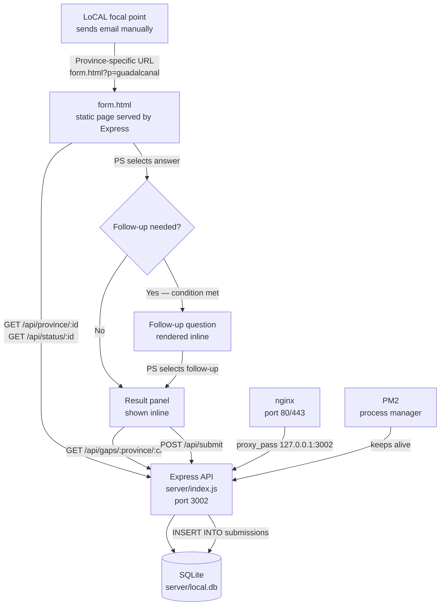
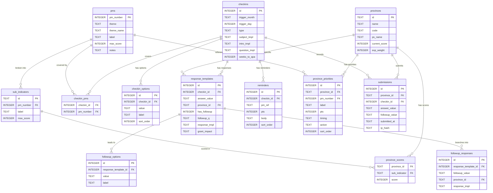
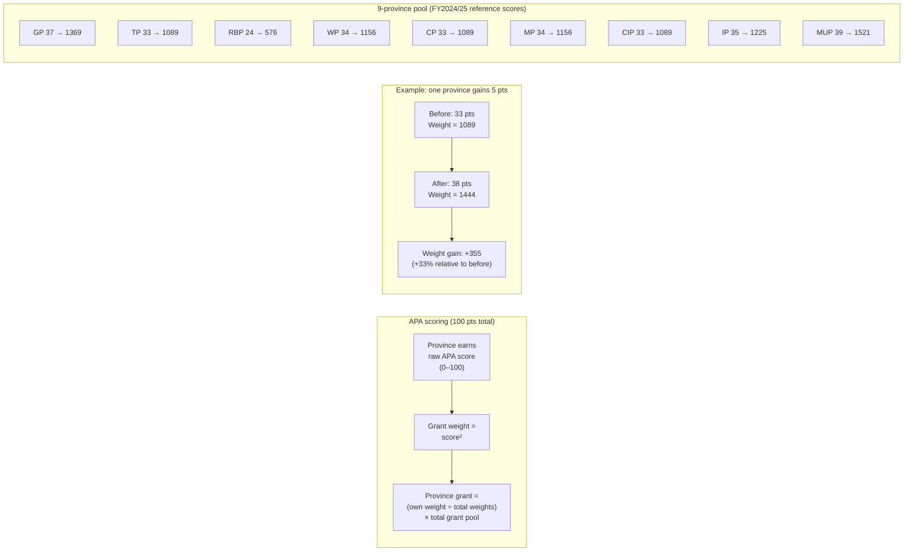

# LoCAL Check-in Agent — Architecture

## Overview

The LoCAL Check-in Agent is a web tool that sends periodic prompts to the nine Provincial Secretaries (PS) of Solomon Islands, collects a one- or two-question response via a mobile-friendly web form, and immediately shows the PS a personalised action plan. The goal is to nudge each province toward completing the specific activities that determine their Annual Performance Assessment (APA) score — because the APA score is squared to determine each province's share of UNCDF climate finance grants, so every point gained compounds significantly. The system covers all 18 Performance Measures (PMs) across nine check-in touchpoints spread through the April–March fiscal year.

---

## System flow



**Current state:**
- `form.html` is the live frontend. It reads province and check-in data from the API and from hardcoded `CI_META` objects in the page's own `<script>` block.
- The Express API (`server/index.js`) is running and serves all endpoints.
- nginx proxies port 80/443 to port 3002. PM2 keeps the Node process alive.
- Domain: **pcdftracker.com** (purchased; DNS propagation pending as of May 2026; SSL cert to be issued via certbot once DNS propagates).
- Response content (`response_templates`, `reminders`, `province_priorities`) is not yet in the database — it lives as JavaScript in `form.html`'s `CI_META`.

---

## Database schema



**Key design notes:**
- `province_scores` has 279 rows (9 provinces × 31 sub-indicators), representing the most recent APA results. These are reference data — APA scores reset from zero each assessment cycle.
- `response_templates.province_id` is nullable: a NULL row is the default response for all provinces; a non-null row overrides it for a specific province.
- `exp_weight` in `provinces` is always `current_score²` — it is stored for quick reference but derived from `current_score`.

---

## Check-in schedule

```mermaid
gantt
    title Check-in schedule — April to March fiscal year
    dateFormat MM
    axisFormat %B

    section Fiscal year
    FY start (1 April)         : milestone, m1, 04, 0d

    section Check-ins
    CI 1 — April: CCARRO in post? (PM12)                    : ci1, 04, 1M
    CI 2 — June: CC awareness sessions (PM14+15)            : ci2, 06, 1M
    CI 3 — July: Climate data in PG database (PM1+2)        : ci3, 07, 1M
    CI 4 — August: APA documentation reminder (no reply)    : ci4, 08, 1M
    CI 5 — October: Planning season briefing (PM3–9)        : ci5, 10, 1M
    CI 6 — December: Mid-planning check (PM4+5+10+11)       : ci6, 12, 1M
    CI 8 — Quarterly report due (PM16)                      : ci8, 04, 12M
    CI 7 — February: Engineer sign-off + tender (PM9+13)    : ci7, 02, 1M
    CI 9 — September: PBCRG utilisation check (PM17+18)     : ci9, 09, 1M

    section APA window
    APA assessment visit (target: August)                   : apa, 08, 2M
```



**Check-in types:**
- `activity-linked` (8 of 9): asks a yes/no or multiple-choice question and returns a personalised response.
- `activity-agnostic` (CI 4 only): a one-way documentation reminder — no question, no reply expected.

**CI 8 (quarterly PBCRG report)** fires four times per year (October, January, April, July) rather than once. The `trigger_month = 'Quarterly'` value in the database signals this.

---

## Scoring logic



**Why it matters:** a province at 33 points has a weight of 1089. Gaining 5 points takes it to 38 (weight 1444), a 33% increase in grant share from a 15% increase in score. The exponential formula means gains in the mid-range (30–45) have the steepest marginal return. All scores reset to zero each APA cycle — every point must be re-demonstrated with fresh evidence.

---

## Component descriptions

### Frontend

| File | Responsibility |
|---|---|
| `form.html` | Single-file app. Renders a province dashboard showing all 9 check-ins as a tracker list. Fetches province data and status from the API on load. Opens question panels inline on click. Contains `CI_META` — hardcoded check-in content: topic, question text, follow-up logic, and response functions. Posts submissions to `/api/submit`. Served as a static file by Express from the project root. |

### Backend — `server/`

| File | Responsibility |
|---|---|
| `index.js` | Express API. 7 endpoints: province list, single province + scores, checkin definition + options, gaps for a province/checkin pair, submit a response, province status, all submissions. See `docs/API.md` for full reference. |
| `schema.sql` | Authoritative SQLite schema. Defines all 13 tables. Applied by `seed.js` on every run (`CREATE TABLE IF NOT EXISTS`). |
| `seed.js` | Populates all reference data: 9 provinces, 18 PMs, 31 sub-indicators, 279 province scores, 9 check-in definitions, 29 check-in/PM mappings, 22 answer options. Uses `INSERT OR REPLACE` in a single `better-sqlite3` transaction. Safe to re-run. |
| `local.db` | SQLite database file. Not committed to version control. Recreate with `node seed.js`. |
| `package.json` | Dependencies: `express` (v5), `better-sqlite3`, `cors`. |

### Infrastructure

| Component | Details |
|---|---|
| nginx | Reverse proxy. Config at `/etc/nginx/sites-available/pcdftracker.com`. Proxies port 80/443 to `127.0.0.1:3002`. |
| PM2 | Process manager. Keeps `server/index.js` alive. Process name: `local-checkin`. |
| certbot | SSL certificate management. Auto-renews via systemd timer. Certificate to be issued once DNS propagates. |

### Legacy files (not used by the current system)

| File/Directory | Status |
|---|---|
| `checkin.html`, `checkin.css`, `checkin.js` | Original static-form architecture. `checkin.js` hardcoded all province/check-in data as JS objects. Replaced by `form.html` + Express API. |
| `apps-script/` | Google Apps Script files (`webhook.gs`, `webapp.gs`, `form-agent.gs`). The Apps Script webhook is no longer in the flow — submissions go directly to the Express API. |
| `email-templates/` | Manually adapted HTML email templates from the Apps Script era. |

---

## Data flow

```
1. Focal point composes email manually, includes URL:
   https://pcdftracker.com/form.html?p=guadalcanal

2. PS clicks link → browser loads form.html from Express static handler

3. form.html fires two parallel API calls:
   GET /api/province/guadalcanal  → province name, score, sub_scores, pm_totals
   GET /api/status/guadalcanal    → completion status for all 9 check-ins

4. Page renders: province header with score badge, list of all 9 check-ins
   with done/pending/open status dots

5. PS clicks a check-in row → inline question panel expands
   (CI 4 shows result immediately — no question)

6. PS selects an answer:
   - If the check-in has a follow-up condition and the answer meets it,
     the panel replaces itself with the follow-up question
   - Otherwise, finaliseCI() runs immediately

7. finaliseCI():
   - GET /api/gaps/:province/:ci — fetches current scores for this check-in's PMs
   - POST /api/submit — logs the response (fire-and-forget, errors silently ignored)
   - Calls CI_META[id].response(answer, followup, province, gaps) — runs
     the hardcoded response function to produce { type, title, body }
   - Renders the result panel inline: status tag, guidance text, PM gap list,
     grant impact bar (current score → potential score, multiplier)

8. Submission row inserted into SQLite submissions table.
   No email is sent. No Sheet is updated.
```

---

## Open items

| Item | Description |
|---|---|
| **`response_templates` content** | The table exists in the schema but has no rows. All response text currently lives as JavaScript in `form.html`'s `CI_META`. Populating this table for all 9 check-ins × answer paths × 9 provinces is the main content authoring task remaining. |
| **`reminders` content** | Table schema-only. Per-check-in reminder bullet points not yet seeded. |
| **`province_priorities` content** | Table schema-only. Per-province quick-win action items not yet seeded. |
| **Email sending** | Emails are currently sent manually (focal point composes and sends). No automated scheduled send exists. PS email addresses are NULL for all 9 provinces. |
| **Google Sheets sync** | No sync between the SQLite `submissions` table and any external spreadsheet. |
| **PS email addresses** | `ps_name` is NULL for all 9 provinces; PS email addresses are not stored anywhere in the current system. These must be added before any automated sending. |
| **SSL certificate** | Domain pcdftracker.com is purchased; DNS has not yet propagated. Certbot certificate to be issued once DNS resolves. |
| **PBCRG pool size (SBD)** | Exact annual allocation not confirmed. Needed to make the grant impact figures concrete. |
| **PM#16–18 activation date** | Check-ins 8 and 9 are relevant only once PBCRG grants are disbursed. Confirmation of the first disbursement date is pending. |
